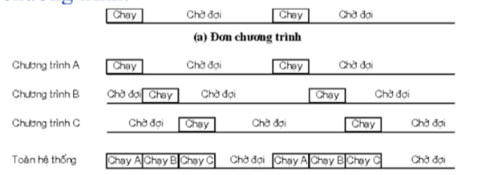

# I. Các thành phần của hệ thống máy tính
Hệ thống máy tính bao gồm ba thành phần chính: `Phần cứng`, `phần mềm`, và `hệ điều hành`

- `Phần cứng` cung cấp các tài nguyên cần thiết cho việc tính toán và xử lý dữ liệu
- `Phần mềm` bao gồm các chương trình cụ thể, được chia thành phần mềm hệ thống và phần mềm ứng dụng
- `Hệ điều hành` đóng vai trò là phần mềm trung gian giữa phần cứng và người sử dụng chương trình ứng dụng, giúp việc sử dụng hệ thống máy tính trở nên tiện lợi và hiệu quả

# II. Khái niệm và chức năng của hệ điều hành
HDH là 1 hệ thống phần mềm trung gian giữa người sử dụng và phần cứng của máy tính, thực hiện hai chức năng cơ bản:

1. **Quản lý tài nguyên:**
    - Đảm bảo các tài nguyên hệ thống(CPU, bộ nhớ chính, bộ nhớ ngoài, ...) được sử dụng một cách có ích và hiệu quả
    - Theo dõi và quản lý trạng thái sử dụng tài nguyên.
    - Ngăn chặn xâm phạm tài nguyên, đảm bảo các chương trình không ảnh hưởng lẫn nhau.

2. **Quản lý việc thực hiện các chương trình:**
    - Nhiệm vụ chính của máy tính: thực hiện chương trình(tiến trình)
    - HDH hỗ trợ chạy chương trình dễ dàng hơn
    - HDH tạo môi trường thuận lợi bằng cách cung cấp máy ảo(tài nguyên ảo)
    - HDH cung cấp dịch vụ cơ bản, dễ sử dụng hơn so với tài nguyên thực

# III. Các dịch vụ do HDH cung cấp
Các dịch vụ cơ bản của HDH:
- `Tải và chạy chương trình`: Tự động quản lý việc nạp chương trình, thực hiện lệnh và giải phóng tài nguyên
- `Giao diện người dùng`: Cung cấp dòng lệnh hoặc giao diện đồ họa để tương tác
- `Thao tác vào/ra dữ liệu`: Hỗ trợ các hoạt động nhập/xuất thông tin
- `Quản lý hệ thống file`: Đọc, ghi, tạo, xóa file/thư mục; quản lý quyền truy cập và sao lưu
- `Phát hiện và xử lý lỗi`: Đảm bảo hệ thống ổn định, xử lý lỗi phần cứng và phần mềm
- `Truyền thông`: Cho phép thiết lập liên lạc và trao đổi thông tin giữa các tiến trình hoặc hệ thống
- `Cấp phát tài nguyên`: Phân phối tài nguyên công bằng, hiệu quả trong hệ thống đa chương trình
- `An ninh và bảo mật`: Kiểm soát truy cập tài nguyên, ngăn truy cập trái phép, đặc biệt trong hệ thống nhiều người dùng

# IV. Giao diện lập trình của HDH
Để các chương trình có thể sử dụng các dịch vụ của HDH, HDH cung cấp **giao diện lập trình**. Giao diện này bao gồm các **lời gọi hệ thống**(system call) mà chương trình ứng dụng sử dụng để yêu cầu dịch vụ. Các lời gọi hệ thống được thực hiện thông qua **thư viện hệ thống**(system library)

# V. Quá trình phát triển
## 1. Xử lý theo mẻ:
- Gồm các chương trình có yêu cầu giống nhau
- Mẻ được nạp vào băng từ và tải vào máy tính
- Xử lý theo mẻ sẽ có 1 chương trình nhỏ gọi là chương trình giám sát. Khi 1 chương trình của mẻ kết thúc thì chương trình giám sát tự động nạp chương trình tiếp theo và chạy

- Ưu điểm:
  - Giảm thời gian chuyển đổi giữa 2 chương trình trong mẻ
- `Hỏi`: Mẻ có cần hdh không? -> Có, vì các chương trình trong cùng 1 mẻ được tự động hóa mà không cần sự can thiệp thủ công của con người

## 2. Đa chương trình
- Hệ thống chứa đồng thời nhiều chương trình trong bộ nhớ
- Khi 1 chương trình phải dừng để thực hiện vào/ra, HDH sẽ chuyển CPU để thực hiện chương trình khác.

    => Giảm thời gian không chạy của CPU

    

- Đòi hỏi hỗ trợ từ phần cứng, khả năng vào/ra bằng ngắt và DMA(Direct Memory Access).
- Hạn chế:
  - Không cho phép người dùng tương tác với hệ thống vì thời gian từ khi người dùng gõ lệnh tới khi máy tính phản xạ tương đối nhỏ, ký thuật đa chương trình không đảm bảo được thời gian đáp ứng ngắn như vậy.

## 3. Chia sẻ thời gian
- Được coi như là đa chương trình cải tiến
- CPU lần lượt thực hiện các công việc khác nhau trong những khoảng thời gian ngắn được gói là lượng tử thời gian
- Chuyển đổi giữa công việc diễn ra với tần số cao và tốc độ CPU lớn

# VI. Cấu trúc HDH
## Các thành phần chính của cấu trục HDH: 
  - Quản lý tiến trình
  - Quản lý bộ nhớ
  - Quản lý vào ra
  - Quản lý tệp và thư mục
  - Hỗ trợ mạng
  - Giao diện với người dùng
  - Các chương trình tiện ích
## Chế độ nhân(Chế độ đặc quyền) với đầy đủ quyền truy cập và điều khiển hệ thống và chế độ người dùng, nơi các chương trình ứng dụng bị hạn chế quyền sử dụng phần cứng 

## Một số kiểu cấu trúc HDH:
  
1. Cấu trúc nguyên khối: 
    - Toàn bộ chương trình và dữ liệu của HDH có chung một không gian nhớ
    - Ưu điểm: nhanh
    - Nhược điểm: không an toàn, kém mềm dẻo và khó sửa đổi

2. Cấu trúc vi nhân:

    - Nhân có kích thước nhỏ, chỉ chứa các chức năng quan trọng nhất, các chức năng còn lại được đặt vào các modul riêng
    - Ưu điểm: dễ sử dụng và sửa lỗi
    - Nhược điểm: tốc độ chậm hơn cấu trúc nguyên khối

3. Cấu trúc phân lớp: 

    - Các thành phần được chia thành các lớp chồng lên nhau
    - Mỗi lớp chỉ liên lạc với lớp kề bên trên và bên dưới nó
    - Mỗi lớp chỉ có thể sử dụng dịch vụ do lớp nằm ngay bên dưới nó
    - Ưu điểm: dễ sử dụng và sửa đổi
    - Nhược điểm: khó thiết kế và tốc độ chậm hơn cấu trúc nguyên khối